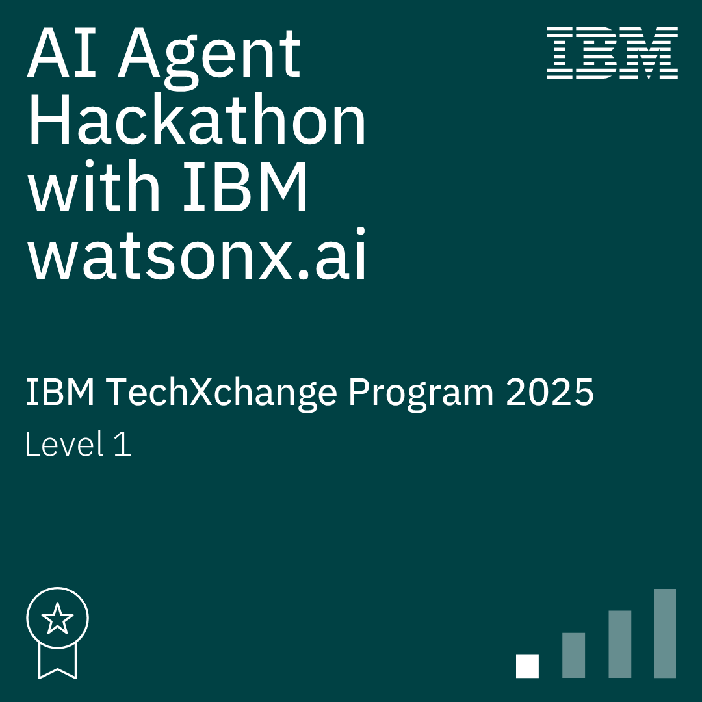

<!DOCTYPE html>
<html lang="en">
<head>
  <meta charset="UTF-8" />
  <meta name="viewport" content="width=device-width, initial-scale=1" />
  <title>Ngusa - Portfolio README</title>
  
  <!-- Montserrat Google Font -->
  <link href="https://fonts.googleapis.com/css2?family=Montserrat&display=swap" rel="stylesheet" />
  
  
</head>
<body>

  <h2>👋 Hello world!</h2>

  
I'm <strong>Ngusa</strong>, a passionate <strong>Tech Enthusiast</strong> crafting impactful full-stack applications — now diving deep into the world of <strong>Machine Learning</strong>, <strong>Neural Networks</strong>, and <strong>Quantum Computing</strong>.

  

  <table>
    <tr>
      <td width="33%">

        <h3>💡 About Me</h3>
        <ul>
          <li>👨‍💻 I build scalable, user-friendly web applications using modern technologies</li>
          <li>🧠 Currently exploring the foundations of <strong>Artificial Intelligence</strong> and <strong>Quantum-enhanced learning systems</strong></li>
          <li>💬 I thrive on collaboration, feedback, and open knowledge sharing</li>
          <li>📈 Always growing — as a developer, researcher, and creative thinker</li>
        </ul>

      </td>
      <td width="33%">

        <h3>🛠️ Tech Stack</h3>
        
<strong>Full-Stack Frameworks</strong> 
          
          
          
        

        
<strong>Machine Learning & AI</strong> 
          
          
          
          
        

        
<strong>Database & DevOps</strong> 
          
          
        

        
<strong>Design & Prototyping</strong> 
          
        

      </td>
      <td width="33%">

        <h3>🔍 Currently Exploring</h3>
        <ul>
          <li>📚 Core principles of <strong>Machine Learning</strong> & <strong>Deep Learning</strong></li>
          <li>🧠 Architectures like <strong>Neural Networks</strong>, <strong>CNNs</strong>, and <strong>Transformers</strong></li>
          <li>⚛️ Researching the intersection of <strong>Quantum Computing</strong> and <strong>AI</strong></li>
          <li>🧪 Building ML side-projects to learn by doing and experimenting</li>
        </ul>

      </td>
    </tr>

  </table>

  

  <h2>🏅 AI Agent Hackathon with IBM watsonx.ai</h2>

  
<strong>📅 April 29 – 31, 2025</strong>

  <blockquote>
    
<strong>“Minutes to Action”</strong> is an AI-powered virtual assistant built using IBM watsonx.ai that transforms unstructured meeting discussions into clear, actionable summaries. 
    It identifies key decisions, extracts tasks with deadlines, and sends reminders via Slack or email to boost team productivity and accountability.

  </blockquote>

  

  <h3>🧠 Key Learnings</h3>
  <ul>
    <li>Developed a full AI agent pipeline using IBM watsonx.ai</li>
    <li>Extracted tasks and decisions from raw meeting transcripts</li>
    <li>Automated Slack/email reminders with deadlines</li>
    <li>Practiced prompt engineering and API integration</li>
  </ul>

  <h3>🗂️ Repo</h3>
  
<a href="https://github.com/meena108/minute-to-action.git" target="_blank" rel="noopener noreferrer">📁 minute-to-action</a>

  

  <h3>📬 Let's Connect</h3>
  <ul>
    <li>📧 Email: <a href="mailto:ngusadeep@gmail.com">ngusadeep@gmail.com</a></li>
    <li>🌐 Portfolio: <a href="https://ngusadeep.com" target="_blank" rel="noopener noreferrer">ngusadeep.com</a></li>
    <li>💼 LinkedIn: <a href="https://www.linkedin.com/in/samwel-ngusa-aab144244" target="_blank" rel="noopener noreferrer">samwel-ngusa</a></li>
  </ul>

  

  <h3>🌟 Quote That Drives Me</h3>
  <blockquote>
    
<em>"Keep building with faith. Never stop learning."</em>

  </blockquote>

</body>
</html>
